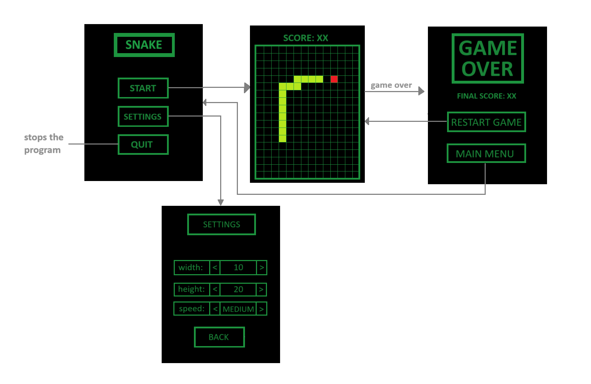

# LDTS - Project 1: Snake

## Description:
The game to be implemented in our project is going to be a recreation of the classic game "Snake". The player must control a snake in a grid and eat the fruit on the grid. When the fruit is eaten, another one pops up at a random position. As the player eats the fruits, the snake grows in size, making it more difficult to move it around the grid. The player loses if the head of the snake hits one of the edges of the grid or a part of its own body.

## Implemented Features

- **Main Menu** - The Main Menu is shown when the player boots up the game and lets the player start the game with the default settings or access the Settings Menu.
- **Settings Menu** - The user can access the Settings Menu from the main menu where they can change the game size, speed and obstacle appearence rules.
- **Different configurations** - The user can pick from 18 total possible settings configurations according to their tastes. They can pick from 3 different game speeds, 3 different window sizes and a toggle for the appearence of walls that make it more difficult to traverse the game area.
- **Player movement** - Once in-game, the player's snake will automatically move foward at the speed defined in the Settings menu and the player can change direction by pressing the arrow keys.
- **Collision detection** - Once in-game, if the player's snake runs into an obstacle, one of the edges of the grid or itself the game will end and the player will be brought to the Game Over Menu.
- **Game Over menu** - The Game Over Menu is shown whenever the player fullfills the conditions necessary to lose the game. The player has the option to try again using the same settings.

## Planned Features

- The only planned feature that wasn't implemented was the High Score system.
- The appearence of walls as obstacles was implemented despite not being in the planned features.

## Design

### General Structure

#### The Patters:
In this project we utilized the Model-View-Controller **Architectural Pattern**, which allowed us to handle the data structure, the visuals and the internal logic separately. This made it easier to follow the Single Responsibility Principle.
We also used the **State Pattern**, which lets the behavior of an object easily change depending on what its internal state is.

#### Implementation:
Regarding the implementation, we now have classes which main purpose is to store data (model), classes that control the logic of the game (controllers) and classes that are responsible for the visual effects on the screen (viewers), these types of classes associate with each other in the following manner:

Regarding the implementation, the MVC pattern lets us maintain classes with different functions. The model classes store and structure the game's data, the viewer classes deal with everything related to displaying the UI and other graphical elements while the controller classes manage the underlying logic of the game.
The way these elements interact with each other are explained in the following image:

  

  <b><i>
  Fig 1. Model, Controller and Viewer pattern design. 
  Attributions and copyright licensing by [Mozilla Contributors](https://developer.mozilla.org/en-US/docs/Glossary/MVC/contributors.txt) is licensed under [CC-BY-SA 2.5](https://creativecommons.org/licenses/by-sa/2.5/)
  </i></b>

## Graphics Mockup

## UML Diagram

## Patterns
- Model-View-Controller (MVC) architectural pattern, which essentially divides our project into three parts: the model, which represents the data of the project; the view, which displays the data to the user; and the controller, which handles user input

- State Pattern, given that our game can either be in the menu or in the actual gameplay (it has 2 states), which means that it can have different behaviours which have to be switched during runtime (going from the menu to the game and vice-versa)

- l03gr05.Game Loop Pattern, considering that a game loop runs continously during runtime, constantly updating the game state, handling user input and rendering the game's output
